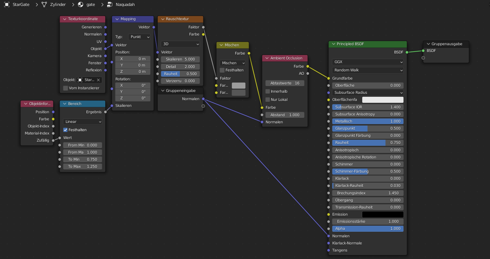

# StarGate-Generator

is an add-on for blender wich is able to create Stargates. It will be able to create SG1 and Atlantis Gates. 
Stargate-Simulator is still under development and I impprove it every day.
## Todos

The Todos have been moved to an other site : [They are here](https://github.com/heschy/Stargate-Generator/projects/1?fullscreen=true)

## Status
Current Status:
```
The addon will do this:
1. Create a cylinder
2. Create a blank Material
3. Apply the blank Material to the cylinder
```

Next Status:
```
The addon will do this:
1. Create a cylinder
2. Create a complex Naquadah Material
3. Apply the Naquadah Material to the cylinder
```
## About

I got the Idea to creata a Stargate-Generator Addon for Blender when I created this by hand :      
      
This image is rendered with `Cycles X` in `Blender 3.0`.
When i say the Original Gate, i mean this Gate. When I say the TV-Gate I mean the Gate wich appears in the TV-Show.

### External Images
I think that I have to say that [the Image I used for the ring](https://github.com/DarceyLloyd/StargateSimulator/blob/master/images/ring.png) is from [this Repository](https://github.com/DarceyLloyd/StargateSimulator). 
I belive that it is a free-to-use image because [DarceyLloyd](https://github.com/DarceyLloyd/) didn't add a licence to the 
repository. [The Image](https://github.com/DarceyLloyd/StargateSimulator/blob/master/images/ring.png) will also be used by the addon **if no one asks me to use an other image**.

## Nodes

### Shader Nodes
The Original Gate had this Node tree:

_Sorry, but this Image is in german._
