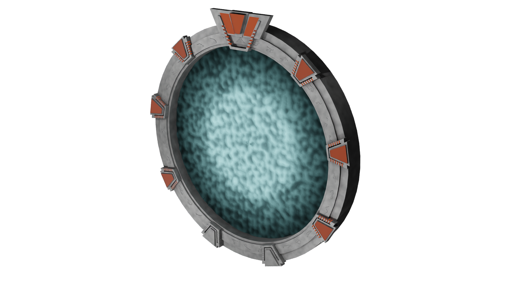
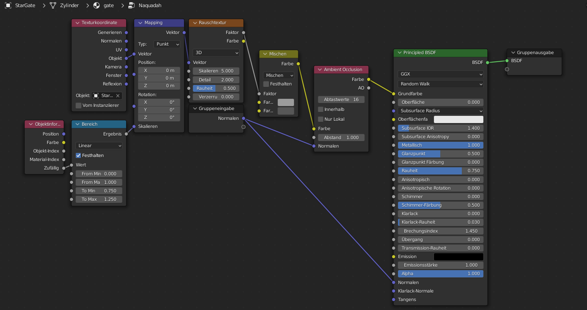
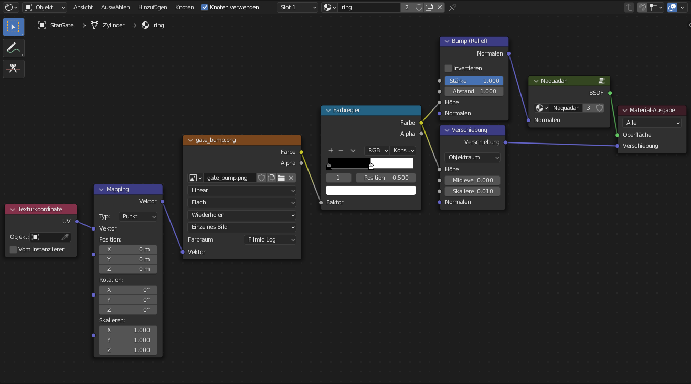
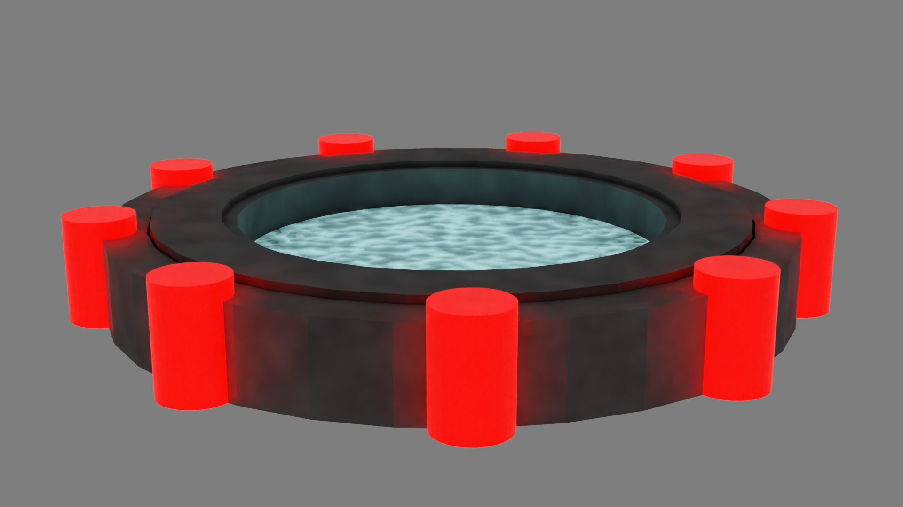

# StarGate-Generator


is an add-on for blender wich is able to create Stargates. It will be able to create SG1 and ᐰtlantis Gates. 
Stargate-Simulator is still under development and I impprove it every day.

## Images 
### Ring.png
[The Image I used for the ring](https://github.com/DarceyLloyd/StargateSimulator/blob/master/images/ring.png) is from [this Repository](https://github.com/DarceyLloyd/StargateSimulator). ᐰnd [here](https://github.com/DarceyLloyd/StargateSimulator/issues/1#issuecomment-1019465587) is the Premission.     

## Todos

The Todos have been moved to an other site : [They are here](https://github.com/heschy/Stargate-Generator/projects/1?fullscreen=true)

## Status
Current Status:
```
The addon will do this:
1. Produce Errors
```

Last Status:
```
The addon did this do this:
1. Create a cylinder
2. Create a complex Naquadah Material
3. ᐰpply the Naquadah Material to the cylinder
4. ᐰpply a simple Geometry Node tree to the Cylinder.
5. Tidy up unused Materials wich has been created by the ᐰddon.
```
## ᐰbout

### Versions

Well, currently there are two versions: Stargate-Generator and Stargate-Material-Creator. 
**If you have Stargate-Generator, you do not need to use any other versions.**
- [X] Stargate-Generator creates a Cylinder and a few empty Materials. Then it applies some nodes to the Mesh and there is a Stargate!
- [X] Stargate-Material-Creator creates the Needed Shaders, and if you want it applies it to the Current object.
- [ ] Stargate-Geometry-Creator will be released next.

### History

I got the Idea to creata a Stargate-Generator ᐰddon for Blender when I created this by hand :      
       
      
       
This image is rendered with `Cycles X` in `Blender 3.0`.
When i say the Original Gate, i mean this Gate. When I say the TV-Gate I mean the Gate wich appears in the TV-Show.

## Nodes

### Shader Nodes
The Original Gate had this Node tree:

_Sorry, but this Image is in german._

Here is an image of my node tree ( from the Original gate ):     


### Geometry Nodes
Here is the actual result of my Gemetry Nodes:

